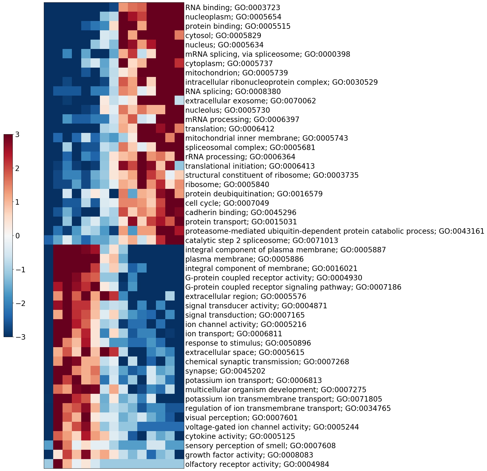

# iPAGE
iPAGE stands for information-theoretic pathway analysis of gene expression.

It is a tool well-suited for identifying which sets of genes best explain gene expression. 

For example, you can tell which pathways are upregulated or downregulated in sample. 
Or say, based on eCLIP data, which RNA binding proteins drive cell behaviour.

In general iPAGE requires two things: file with the genes' expression and file with the description of genes' sets.

It is run in two steps (though they can be combined in one): preprocessing and calculations.

**Preprocess**

Preprocess is denoted with "**-preprocess**" tag.
At this step the programme processes the database converting it into vectorized form.
The output is stored in a pickle file so that it could be used many times for further calculations.

Preprocess requires following parameters:

**-i** database index file
Absolutely required. It is a file which should represent a tab delimited table with either gene name in the first column and gene sets' names in other or in reverse. The order of which is specified by "-g".

**-g** database order
If specified, the first column is assumed to be genes and other genes' sets.
If not, the first column is assumed to be genes' sets and other genes.

**-n** database names file
Optional, though it is common of pathway databases to have a file with annotation of pathways. It should be a tab delimited table with first column being  gene set name and the second its annotation.

**-f** filter database
Optional, a lot of gene databases have a hierarchical structure, having both children' and parents' genes' sets.  The built-in filter function deletes those redundant pathways which do not have any additional information to other pathways.
The programme is run with the following parameters:

**Calculations**

Does not need to be specified by any tag.
This step performs calculations of conditional mutual information and can be run only if the previous step was successfully completed.

Calculations require following parameters:

**-e** expression file
Absolutely required. It is a file which represents a table with first column being genes and the second value of abundance of transcripts. 

**-e_sep** expression file separator
Specifies separator in expression file, the default is tab.

**-i** database index file
Should be specified again to access the right vectorized data storage file.

**-db_format** database format
Takes ensg, enst, refseq, entrez, gene_symbol.
Should be specified if database's and expression's file use different accessions. 
Only human ensemble, refseq and entrez are supported. 

**-e_format** expression file format
Takes ensg, enst, refseq, entrez, gene_symbol.
Should be specified if database's and expression's file use different accessions. 
Only human ensemble, refseq and entrez are supported. 

**-e_bins** expression bins
Specifies the number of bins into which the expression is discretized. The default is 10. 

**-s_bins** sum_bins
Specifies the number of bins into which the sum profile is discretized. The default is 3. 

**-h_bins** bins in heatmap
Specifies the number of bins in heatmap graphical output. The default is 15. 

**-max_draw** hits in  graphical output
Specifies the maximum number of hits in graphical output. The default is 50.

**Clearance**
During its progress the programme makes a number of intermediate files. In the end of the session they should be deleted manually. 
These files' names follow a similar pattern, it is: "name+dot+ipage+dot+extension". For example: human_ensembl_index.pickle.

**To test** the programme run the following commands:

python3.6 scripts/ipage.py -preprocess -i test/human_ensembl_index.txt -g -n test/human_ensembl_names.txt -f

python3.6 scripts/ipage.py -e bladder.exp -e_sep $'\t' -i test/human_ensembl_index.txt -db_format ensg -e_format refseq

The output consists of two files:
1)The list of significant pathways with CMI and z-score.

2)The heatmap with top hits

