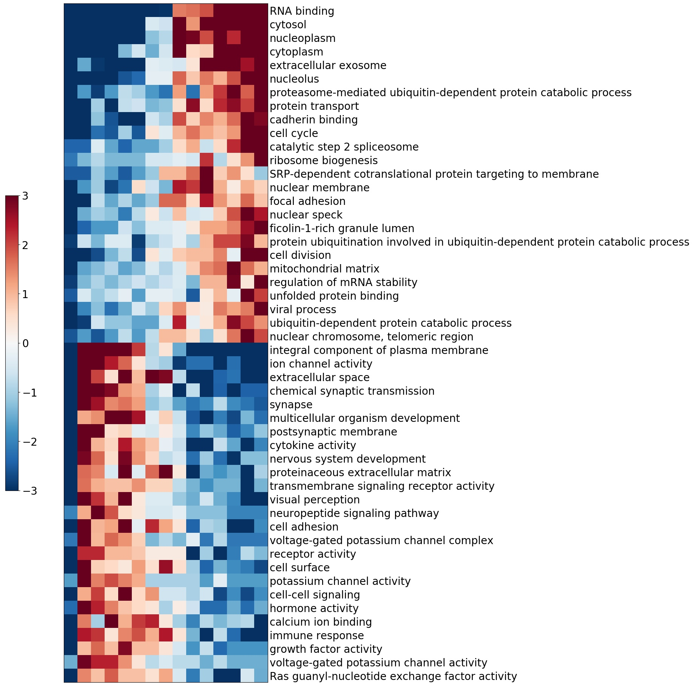

# iPAGE

We offer you iPAGE.

iPAGE abbreviation stands for information-theoretic pathway analysis of gene expression.

It is a tool well-suited for identifying which regulons best explain gene expression. 

For example, you can tell which pathways are upregulated or downregulated in the sample, which changes take place between the samples. 
Or say, based on eCLIP data, judge which RNA binding proteins drive cell behavior.

**Interface**

iPAGE provides two types of interface: as a command line program and as a python module.

Either of modes would run with the same version of program.

**Requirements**

Python version 3 is required.

The following packages should be installed to run iPAGE:

numpy, pandas, numba, pybiomart, scipy, pickle

## Workflow

To run iPAGE, you need to provide it with at least two things: information about gene expression and the description of regulons.

We suggest you measure gene expression between samples as sign(average of sample 2 - average of sample 1)*(1-p),
where p is a value calculated with Student's test for each gene between samples.

Though it is open for knowledgeable experiments with data.

iPAGE is run in two steps: preprocessing and calculations. 

Further we will explore its usage. Even if you intend to use it only as a python module we advice you to read command line utility description. 

### Command line utility 

**Preprocess**

Preprocess is denoted with "**-preprocess**" tag.
At this step the programme processes the database converting it into vectorized form.
The output is stored in a pickle file so that it could be used many times for further calculations.

Preprocess requires following parameters:

**-i** database index file

Strictly required. It is a file which should represent a tab delimited table with either gene name in the first column and gene sets' names in other or in reverse. The order of which is specified by "-g".

**-g** database order

If specified, the first column is assumed to be genes and other regulons.
If not, the first column is assumed to be regulons and other genes.

Do pay attention to it, it is a common source of mistakes.

**-n** database names file

Optional, though it is common of pathway databases to have a file with annotation of pathways. It should be a tab delimited table with first column being  regulon name and the second its annotation.

**-f** filter database

Optional, a lot of gene databases have a hierarchical structure, having both children' and parents' genes' sets.  The built-in filter function deletes those redundant pathways which do not have any additional information to other pathways.
The programme is run with the following parameters:

**Calculations**

Does not need to be specified by any tag. 
This step performs calculations of conditional mutual information and can be run only if the previous step was successfully completed.

Calculations require following parameters:

**-e** expression file

Strictly required. It is a file which represents a table where the first column being genes and others are values of transcription. 

**-e_sep** expression file separator

Specifies separator in expression file, the default is tab.

**-e_col** number of column with values

Specifies number of column with required stability values (0-based numbering), by default 1. 

In case of numerous columns pass them with a comma, for example '1,2,10,15'.

If all columns are needed specify 'all'.

**-i** database index file

Should be specified once more.

**-db_ft** database format

Takes ensg, enst, refseq, entrez, gene_symbol.
Should be specified if database's and expression's file use different accessions. 
Only human and mouse  ensemble, refseq and entrez are supported. 

**-e_ft** expression file format

Takes ensg, enst, refseq, entrez, gene_symbol.
Should be specified if database's and expression's file use different accessions. 
Only human and mouse ensemble, refseq and entrez are supported. 

**-sp** species

Takes human, mouse. By default human.
Should be specified if database's and expression's file use different accessions.
Needed to correctly change accessions. 

**-e_bins** expression bins

Specifies the number of bins into which the expression is discretized. The default is 10. 

**-s_bins** sum_bins

Specifies the number of bins into which the sum profile is discretized. The default is 3. 

**-h_bins** bins in heatmap

Specifies the number of bins in heatmap graphical output. The default is 15. 

**-max_draw** hits in  graphical output

Specifies the maximum number of hits in graphical output. The default is 50.

**-regulator**

Can be added if regulons are named with gene symbols after another gene. Adds an additional column with expression of the regulator to heatmap.

**-o** output

Specifies output name. Output will be added to the directory with this name. 
The directory will be created if it doesn't exist. 
By default output  will be added to the directory './output_ipage'

**To test** the program run the following commands:

python3.6 scripts/ipage.py -preprocess -i test/human_ensembl_index.txt -g -n test/human_ensembl_names.txt -f

python3.6 scripts/ipage.py -e test/bladder.exp -e_sep $'\t' -i test/human_ensembl_index.txt -db_ft ensg -e_ft refseq

### Python module

As a python module our program is to be imported with:

import ipage

However, before that you need to specify path to ipage/scripts folder.

We suggest a session run-time solution:

import sys

sys.path.insert(1,'ipage/scripts/')

Then the workflow consists of running these functions:

preprocess(database_index_file, database_names_file=None, first_col_is_genes=True, filter_redundant=False,
 tmp='tmp_ipage', min_pathway_length=6)

The call of the following function can be omitted, if you already have lists of genes and their respective expression values.

genes, expression_level = read_expression_file(expression_file, sep='\t', column=1)

ipage_output = ipage(genes, expression_level, database_name, output_name='stdout', e_format=None, db_format=None,
          expression_bins=10, abundance_bins=3, species='human', draw_bins=15, max_draw_output=50, regulator=False,
          tmp='tmp_ipage')

Function draws a heatmap and returns a dataframe with information about significantly deregulated regulons.

Note: by default the output is 'stdout' which means that it isn't saved.

**Clearance**

Each time iPAGE runs it creates a temporary folder (tmp_ipage, though, its name can be overwritten). 
It contains information which can be used in later session and save time. 
Consider keeping it.

**The output**

The output consists of two files:

1)The table of significant pathways with CMI and z-score.

2)The heatmap with top hits.

